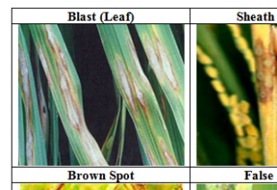
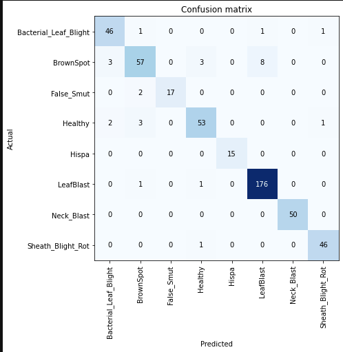

# Rice-Leaf-Classifier
Classifying Paddy Leaves for Detection different types of diseases.

Disease identification is one of the major solutions to
improve the productivity. This also helps to select the
pesticides and prevent from further spreading. Early
detection of diseases will assist in enhancing the
productivity. This classification will help in easy
identification of paddy plant diseases.

The images were classified in 8 classes:

Bacterial_Leaf_Blight, BrownSpot, False_Smut, Healthy-Others, Hispa, LeafBlast, Neck_Blast, Sheath_Blight_Rot

On test data Accuracy is around 85%.

I got the idea from a video shared on Tensorflow Youtube Channel on Cassava Leaf Disease Prediction.

[TensorFlow: an ML platform for solving impactful and challenging problem](https://youtu.be/NlpS-DhayQA)

My aim is to develop such a model for Paddy Plant.

The dataset was compiled from several places:
>[Kaggle1](https://www.kaggle.com/minhhuy2810/rice-diseases-image-dataset)

>[Kaggle2](https://www.kaggle.com/vbookshelf/rice-leaf-diseases)

>Google Image Search

>A part of dataset was downloaded from drive link mentioned in one of the papers [link](https://drive.google.com/drive/folders/1ewBesJcguriVTX8sRJseCDbXAF_T4akK)

I also read several papers:
>https://www.frontiersin.org/articles/10.3389/fpls.2016.01419/full
>https://www.researchgate.net/publication/340690498_Rice_Leaf_Disease_Detection_Using_Machine_Learning_Techniques
>https://www.ijitee.org/wp-content/uploads/papers/v9i5/E2486039520.pdf

I had done several experiments and tried several models but due to some faults, the whole models and notebooks is not available. 

I have whole preprocessed and labelled data, if someone wants to continue the research then I can provide it. 
Try to mail me: kanak8278@gamil.com
